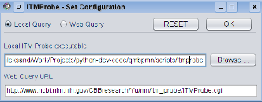
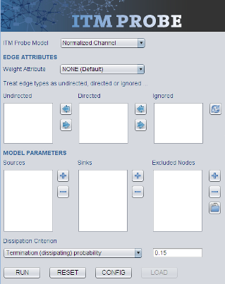
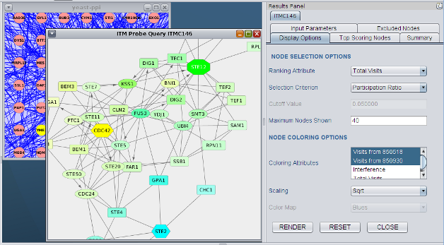

Cytoscape Plugin
================

*CytoITMprobe* is a Cytoscape plugin that provides interface to *ITM Probe*
functionality. It works by querying *ITM Probe* either locally (using the
standalone version from *qmbpmn-tools*) or remotely, through an HTTP request to
a web server. The interface of *CytoITMprobe* is similar to that of the web
version. However, *CytoITMprobe* significantly extends the features of the web
version by supporting input of arbitrary networks and flexible manipulation and
visualization of the query results. The entire results are stored as network
and node attributes,  allowing for their processing using other Cytoscape
plugins with complementary functionality. This allows easy integration of *ITM
Probe* into network-based data analysis workflows.

*CytoITMprobe* was developed for Cytoscape version 2.8. All the source code
written a the NCBI is released into public domain.

Please watch this video demo, which complements the instructions here.

.. raw:: html

    <iframe width="640" height="360" src="http://www.youtube.com/embed/4Cdf-mSKtWo" frameborder="0" allowfullscreen></iframe>

Downloading and Installing
--------------------------

It is possible to download *CytoITMprobe* either as a JAR file ready for
installation as a Cytoscape plugin or as zipped source code archive. Both can
be found on the NCBI FTP site (ftp://ftp.ncbi.nih.gov/pub/qmbpmn/CytoITMprobe/).
Releases of *CytoITMprobe* share version numbers with *qmbpmn-tools*, starting
with 1.4.

To install *CytoITMprobe*, copy the JAR file you have downloaded to the
plugins subdirectory of your Cytoscape distribution or use the menu option
:menuselection:`Plugins --> Install Plugin from File` within Cytoscape. After
successful installation was completed, you will see the **CytoITMprobe** entry
in the **Plugins** menu.

Building from Source
--------------------

The source code was mostly developed using `NetBeans <http://www.netbeans.org/>`_
and built using `Apache Ant <http://ant.apache.org/>`_. To build the JAR file,
you first need to unzip the source distribution file, put ``cytoscape.jar`` onto
your CLASSPATH and copy the file ``build.xml.git`` in the root of the
distribution to ``build.xml``. Then type::

  ant package

to build the JAR named ``CytoITMProbe.jar`` in the root distribution
directory.

Using CytoITMprobe
------------------

Starting plugin from Cytoscape
^^^^^^^^^^^^^^^^^^^^^^^^^^^^^^

Start *CytoITMprobe* by choosing the Cytoscape menu entry
:menuselection:`Plugins --> CytoITMprobe --> Query Form`.
After reading the configuration file (see below), *CytoITMprobe* creates the
query form and inserts it into the Cytoscape Control Panel (on the left of the
Cytoscape window). You may need to resize the Control Panel to see the entire
*ITM Probe* query form.

The query form provides a similar functionality to the query form of
the *ITM Probe* web interface. Three action buttons can be found at its bottom:

* QUERY - to start running a *ITM Probe* query (see :ref:`itm-query-label`);
* RESET - to reset the form;
* CONFIG - to change *CytoITMprobe* configuration (see :ref:`itm-config-label`).
* LOAD - to load *CytoITMprobe* results saved as attributes of the currently
  selected network (see :ref:`itm-restore-label`).

.. _itm-config-label:

Configuration
^^^^^^^^^^^^^

Configuration of *CytoITMprobe* is handled though a separate dialog.

There are two possible configurations:

Web Query
   This option will configure *CytoITMprobe* to query the *ITM Probe* web
   service over HTTP. Choosing this method means that you are not
   required to download and install the *qmbpmn-tools* Python package and its
   dependencies. This is the recommended option.

Local Query
   This option will configure *CytoITMprobe* to run a local ``itmprobe``
   program. Choosing this method means that you need to download and
   install the command-line version of *ITM Probe* and all its
   dependencies. Queries will be generally faster.

Configuring for web queries
"""""""""""""""""""""""""""

Configuring *CytoITMprobe* to perform a web query requires
clicking the "Web Query" radio button and
entering the URL for the *ITM Probe* web services into the "Web Query URL" box.

.. note:: When creating the initial configuration, *CytoITMprobe* will automatically set
  the URL of the default *ITM Probe* web service in the "Web Query URL" box and
  this need not to be changed unless the server address changes.

Configuring for local queries
"""""""""""""""""""""""""""""

Configuring *CytoITMprobe* to perform local queries requires significantly more
work than configuring it to perform web queries. First, you need to download,
and install the *qmbpmn-tools* package and all its dependencies (see
:ref:`qmbpmn-tools-label`). In the configuration dialog you need to click the
"Local Query" radio button and set the path for the ``itmprobe`` executable.

.. _itm-query-label:

Setting up a query
^^^^^^^^^^^^^^^^^^

To run an *ITM Probe* query, you need to specify via the query form a
weighted directed graph, a model (absorbing, emitting or normalized channel)
and some model parameters.

The graph connectivity is specified by selecting a Cytoscape network. In
addition, you must assign a weight and a direction to each link. Edge weights
can be set using the **Weight attribute** dropdown box, which lists all
available floating-point edge attributes of the selected network and the
default option (``NONE``). If the default option is selected, *CytoITMprobe*
assumes the weight 2 for any self-pointing edge and 1 for all other
edges. If an attribute is selected, the weight of an edge is set to the value
of the selected attribute for that edge. Null attribute values are treated as
zero weights.

Since Cytoscape edges are always internally treated as directed, you must also
indicate the directedness of each edge type by placing it into one of the three
boxes: ``Undirected``, ``Directed`` or ``Ignored``. Whenever a different
Cytoscape network is selected, *CytoITMprobe* updates the query form and places
all of the new network's edge types into the ``Undirected``. You can then
use arrow buttons to move some edge types to the ``Directed`` or ``Ignored``
category. Undirected edges are treated as bidirectional, with the same weight
in both directions. Directed edges have a specified weight assigned only in the
source-to-destination direction, with the opposite direction having the zero
weight. Ignored edges have zero weight in both directions. Since Cytoscape
allows multiple edges of different types between the same source and
destination nodes, *CytoITMprobe* collapses multiple edges in each direction
into a single edge by appropriately summing their weights.

The *ITM Probe* model is selected using the eponymous dropdown box. Depending
on the selected model, you then need to select the sources and sinks. The
absorbing model requires only sinks, the emitting model only sources, while the
normalized channel model requires both. The **MODEL PARAMETERS** section
contains three boxes for entering nodes: ``Sources``, ``Sinks`` and ``Excluded
Nodes``. To add a node as a source or a sink, first select it in the current
network and then press the ``+`` button next to the appropriate box. The node
IDs for selected nodes will be added to the list in the box. To remove nodes
from a list, select them and press the ``-`` button next to the box they are
in.

Excluded nodes are specified by placing them into the ``Excluded Nodes``
box. There are two ways to do so: by selecting desired nodes in the network and
using the ``+`` button and by loading a list of identifiers from a text
file. The text file should contain identifiers delimited by one or more
whitespace characters. For example, it can be formatted with one identifier per
line. The identifiers should either be node IDs or ``canonicalName`` node
attributes. Unrecognized attributes are ignored.

The choice of the model also determines the ways in which the dissipation
coefficient can be set. You need to specify two items: the **Damping
Criterion**, using a dropdown box, and the associated value. The default
damping criterion is always ``Termination (Dissipation) probability``, which
requires a value between 0 and 1 and sets dissipation directly. In addition,
the dropdown box will contain one or more model specific choices. The choices
are described in detail in the section :ref:`dissipation-criterion-label`.

To start a query, press the ``QUERY`` button. A progress dialog will
appear and, after some time, the query results (or an error message)
will appear.

Working with the results
^^^^^^^^^^^^^^^^^^^^^^^^

Every completed *CytoITMprobe* query creates a viewer for its results embedded
in Cytoscape Results Panel (located on the right of the Cytoscape main window
when docked) and a new Cytoscape network that shows a subgraph of
significant nodes (ITM subnetwork). To distinguish different queries, each
query has a distinct name consisting of the prefix `ITM` followed by a letter
denoting a model (`A` for absorbing, `E` for emitting, `C` for normalized
channel), followed by a three-digit number (for example `ITME267`). The number
is incremented every time a query is run up to 999 and then reset to 0.

The results viewer consists of five tabs. The tabs titled **Top Scoring
Nodes**, **Summary**, **Input Parameters**, and **Excluded Nodes** contain
information about the query and the results, while the **Display Options** tab
contains a form that allows manipulation of the ITM subnetwork. The form
controls two aspects of the subnetwork: composition (what nodes are selected
and how many) and node coloring.

.. note:: The results viewer and the ITM subnetwork for each query
    query are linked. Destroying the ITM subnetwork will also
    remove the corresponding results viewer from the Results Panel.

ITM Subnetwork
""""""""""""""

.. note:: The visual style for the ITM subnetwork closely resembles the one
          presented by the web version. Of course, Cytoscape gives you the
          complete freedom to modify this look to your requirements.

Subnetwork nodes are selected through a **Ranking Attribute** dropdown box, which
assigns a numerical value from *ITM Probe* results to each node. The nodes are
ranked in decreasing order according to the ranking attribute and top scoring
nodes are displayed as the ITM subnetwork. The number of top scoring nodes is
determined by specifying a **Selection Criterion**, which can be simply a
number of nodes to show, a cutoff value or the :term:`Participation
ratio`. Specifying a cutoff value *x* selects the nodes with their ranking
attribute greater than *x*. The available choice for the ranking attribute
depend on the *ITM Probe* model and the number of boundary points. For the
emitting and normalized channel model, you can select visits to a node from
each source, the sum of visits from all sources or :term:`Interference`. For
the absorbing model, the available attributes are absorbing probabilities to
each sink and the total probability of termination at a sink. The values for
all attributes for the subnetwork nodes are displayed in the **Top Scoring
Nodes** tab.

The colors of the subnetwork nodes are determined by selecting one or more
**Coloring attributes**, a **Scaling Function** and a **Color Map**. The list of
coloring attributes is the same as the list of ranking attributes but you can
select up to three coloring attributes. If a single attribute is selected,
node colors are determined by the selected eight-category
*ColorBrewer* color map. Otherwise, they are resolved by color mixing: each
coloring attribute is assigned a single basic color (cyan, magenta or yellow),
and the final node color is obtained by mixing the three basic colors in
proportion to the values of their associated attributes at that node. The
scaling function serves to scale and discretize the coloring attributes to the
ranges appropriate for color maps.

.. note:: *CytoITMprobe* copies uses the nodes from the original network in the
          newly created ITM subnetwork. Thus, when selecting a node in ITM
          network, you are able to see all of it attributes in the original
          network. However, the edges between nodes are created from
          scratch. This is because Cytoscape allows more than one edge between
          two nodes, although they must be of different type. On the other
          hand, *CytoITMprobe* appropriately sums the weights of all the
          different edges between two nodes and thus cannot distinguish between
          them. Furthermore, the ITM subnetwork appears less crowded
          with only a single edge between a pair of nodes.

.. _itm-restore-label:

Saving and restoring results
""""""""""""""""""""""""""""

Each *CytoITMprobe* query stores its results by setting node and
network attributes in the network used for the query. This network and
its attributes can be saved through Cytoscape, and then be reloaded in
a different session. To restore the corresponding results panel,
select a network containing the results and hit the ``LOAD`` button on the
query form.

.. note:: The ``LOAD`` button will be enabled only if the selected
    network contains saved results and these results are not already
    shown in Results Panel.

Alternatively, the ITM Probe results stored in a network can be exported to
tab-delimited text files through the Cytoscape **Export** menu:
:menuselection:`File --> Export --> ITM Probe Results as TAB File...`.
The tab-delimited export file contains all information necessary to
restore the results except the original network and is easy to read by
both humans and custom programs.

The results from exported tab-delimited files can be restored to a
network through Cytoscape **Import** menu.
You need to select a network and select a  tab-delimited file using the
:menuselection:`File --> Import --> Import ITM Probe Results from TAB File...`
menu item. CytoITMprobe will attempt to load the results as network
attributes and, if successfull, display the corresponding subnetwork
and viewer. The imported ITM will be assigned a new label, as if it
originated from a direct *ITM Probe* query.

.. note:: Only the results for the nodes in the selected network whose
   IDs match the IDs from the imported file will be loaded. Thus, it
   is possible to transfer an ITM from one network to another by
   exporting it and then importing it, as long as the two graphs have
   nodes with IDs in common.

Additional Node Attributes
""""""""""""""""""""""""""

Since the *ITM Probe* query results are saved as Cytoscape attributes of the
original network, you can arbitrarily modify them through Cytoscape. The
changes made in this way are reflected in the results viewer and ITM subnetwork
after you press the ``RESET`` button in **Display Options** tab.

.. warning:: Editing raw results in this way can cause unpredictable effects to
             the functioning of *CytoITMprobe*. Make sure you have the original
             results saved before any editing so you can restore them if
             problems occur.

Using the *CytoITMprobe* attribute nomenclature, you can create additional
attributes to be used for ranking or coloring. Consider the following usage
example. You have ran an emitting model query with three sources, ``S1``,
``S2``, and ``S3``, and obtained the results in a viewer labeled
``ITME243``. At the end of the run, *CytoITMprobe* created the attributes
``ITME243[S1]``, ``ITME243[S2]`` and ``ITME243[S3]`` for the nodes of the input
network and saved the results as their values. Using Node Attribute Browser
within Cytoscape, you can create a new floating-point node attribute with a
label ``ITME243[avgS1S2]`` and fill it with an average of ``ITME243[S1]`` and
``ITME243[S2]`` using Function Builder.

After resetting the Display Options form, an item ``Custom [avgS1S2]`` will be
made available for selection as a ranking or coloring attribute. This gains you
the ability to reinterpret ``S1`` and  ``S2`` as if they were a single source
of equal weight as ``S3``. You can use the same procedure to combine the
results of queries with different boundaries and display them together on the
same subnetwork.

Example
^^^^^^^

Here is a step-by-step example to help you get started with *CytoITMprobe*. It
involves the yeast protein-protein interaction network and the pheromone signal
transduction pathway. The same example can be run by clicking the ``EXAMPLE``
button on the web form.

.. note:: This tutorial assumes basic familiarity with
    Cytoscape and that the *CytoITMprobe* plugin is already properly
    installed.

#. Download a zipped archive ``CytoITMprobe-example.zip``, containing
   a yeast protein-protein interaction network in SIF format, a list
   of excluded nodes and a Cytoscape node attributes file from
   ftp://ftp.ncbi.nih.gov/pub/qmbpmn/CytoITMprobe/example/.

#. Create a new directory and extract the archive in it.

#. Start Cytoscape.

#. Activate *CytoITMprobe* from plugins menu. You may need to enlarge
   the Control Panel to see the entire query form.

#. Using the Cytoscape import dialog accessible from
   :menuselection:`File --> Import --> Network (All file types)...`,
   import the yeast PPI network from the extracted ``yeast-ppi.sif``
   file.

#. Select the new network and import the ``canonicalName`` attribute from the
   extracted ``canonicalName.NA``. You can use VizMapper to use the
   ``canonicalName`` attribute as node label rather than ID.

#. Make sure that the imported network is selected.

#. Activate the *CytoITMprobe* query form. Select ``Normalized Chanel`` as the
   *ITM Probe* model. Move edges of type ``d`` into ``Directed`` box using the
   |rarrimg| buttom next to the ``Undirected`` box. Leave the dissipation criterion
   at the default value: ``Termination (Dissipation) probability`` with the
   probability 0.15.

#. Click on the ``Configure search options`` toolbar
   button and select ``canonicalName`` in the **Select attribute** dropdown
   box. This will allow you to search for network nodes using their
   cannonical names rather than by their numerical IDs.

#. Use the Cytoscape search facility to add the nodes ``STE2`` and
   ``CDC42`` as sources and ``STE12`` as a sink. In each case, start
   by typing the desired node name in the search box; there will be a
   single hit, which will become selected. Use the |plusimg| button next to
   the ``Sources`` or ``Sinks`` box to add the selected node to the
   appropriate list.

#. Press the |openimg| button next to the ``Excluded Nodes`` box and
   load the suggested excluded nodes from the file
   ``yeast-excluded.txt``, which was extracted earlier.

#. Hit the ``QUERY`` button. After a while you will see a new network
   created and a new tab in the Results Panel.

#. You can browse the result tables on the right or try different
   visualizations of the results using the **Display Options** form. By
   default, the ITM subnetwork shows at most 40 nodes using ``Total Visits``
   as the selection criterion. The default coloring attribute is also ``Total
   Visits``. You can change to a mixed color view by selecting more than one
   (but no more than three) attributes in the **Coloring Attributes** list.

#. This finishes the step-by-step tutorial. You can now explore the
   rest of the *CytoITMprobe* interface on your own and perhaps rerun the query
   with different parameters.


..
   Local Variables:
   mode: rst
   indent-tabs-mode: nil
   sentence-end-double-space: t
   fill-column: 70
   End:
