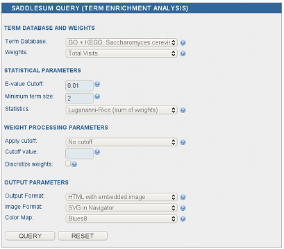

Term Enrichment Analysis
------------------------

While it is possible to specify any proteins in the network as sources
and sinks, not every context produces biologically meaningful
results. In order to help the users to biologically interpret their
results, we have developed
`SaddleSum <http://www.ncbi.nlm.nih.gov/CBBresearch/Yu/mn/enrich/>`_,
a term enrichment tool based on sum-of-weights scores, which gives accurate
gene set enrichment P-values.

For a given set of weights over the network derived from an ITM, it finds the
terms from SaddleSum's term databases (Gene Ontology and KEGG) that
statistically best describe that set of weights. Every *ITM Probe* results page
contains a  query form allowing easy submission of the results to
*SaddleSum*. For details about the query options, refer to the *SaddleSum*
`documentation <http://www.ncbi.nlm.nih.gov/CBBresearch/Yu/mn/enrich/doc/documentation.html>`_.

*SaddleSum query form*


..
   Local Variables:
   mode: rst
   indent-tabs-mode: nil
   sentence-end-double-space: t
   fill-column: 70
   End:
