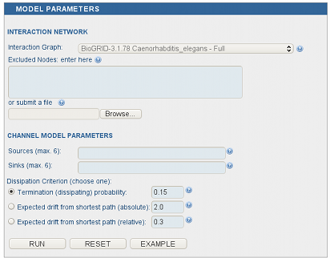

Channel Model
^^^^^^^^^^^^^

The (normalized) channel model requires a context, containing at least
one source, one sink and a node dissipation coefficient between 0
and 1. It is possible to specify at most six sources and six sinks.

*Channel model parameters panel.*


..
   Local Variables:
   mode: rst
   indent-tabs-mode: nil
   sentence-end-double-space: t
   fill-column: 70
   End:
