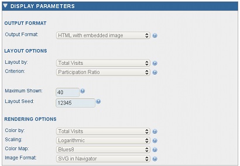

Display Parameters
------------------

Display parameters specify the way the evaluated context query is to be shown in
the results panel. They include the output format, the layout options and the
rendering options. The output format may be HTML, Plain Text or CSV. Only HTML
format support embedded images of ITM subgraphs.

If an ITM image is present, the layout options control the number of most
significant nodes shown and the layout of the nodes in image. The rendering
options specify how a particular layout is colored and rendered. A single
layout can be reused for different renderings, each showing different aspects
of the ITM obtained from the query.

It is possible to specify the display parameters both on the query submission
page and on the results page. To change the display on the results page, adjust
the options in the Display Parameters Panel and hit the **RENDER** button. Only
the image and the number of items in the table of results may change, the
results of the query will remain the same.

*Display parameters panel.*

.. toctree::
   :maxdepth: 1

   web_layout.rst
   web_rendering.rst

