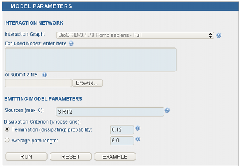

Emitting Model
^^^^^^^^^^^^^^

The emitting model requires a context with one to six sources and a dissipation
coefficient.

*Emitting model parameters panel.*


..
   Local Variables:
   mode: rst
   indent-tabs-mode: nil
   sentence-end-double-space: t
   fill-column: 70
   End:
