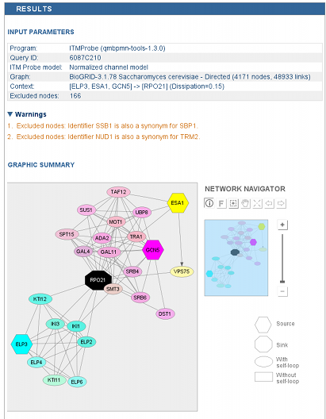
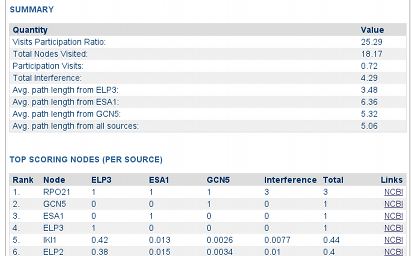

Results
-------

*The top of the Results panel.*

The Results panel consists of the query summary, ITM image, and the
table of the ITM nodes shown in the image. Each row of the node table
contains the protein name, the associated model values and the links
to the NCBI Gene database containing the protein and gene details.

While the table shows only the nodes shown in the graphical display,
the full model solution can be downloaded for further analysis in the
CSV format by hitting the **CSV** button in the Display Parameters panel.

*The middle of the Results panel.*


..
   Local Variables:
   mode: rst
   indent-tabs-mode: nil
   sentence-end-double-space: t
   fill-column: 70
   End:
